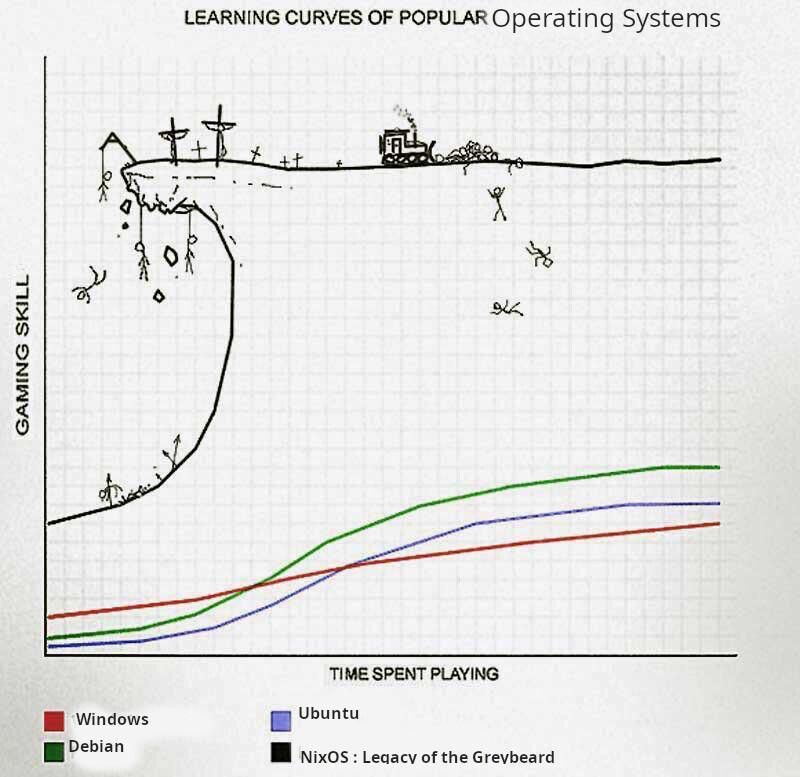

# Nix config

> These are my dotfiles, there are many like them but these ones are mine.
>
> - Dotfiles Creed

## Table of Contents

<!-- TOC -->

- [Nix config](#nix-config)
    - [Table of Contents](#table-of-contents)
    - [Overview](#overview)
    - [:warning: Warning](#warning-warning)
        - [Why?](#why)
    - [Layout](#layout)
        - [Folders](#folders)
    - [Setup](#setup)
        - [Bootstrap](#bootstrap)
    - [Usage](#usage)
        - [NixOS](#nixos)
        - [Home Manager](#home-manager)
    - [Development Shells](#development-shells)
    - [Updates](#updates)

<!-- /TOC -->

## Overview

<p align="center">


<!--

-->

</p>

<p align="center">


</p>

These are my `dotfiles` and system configurations managed as a Nix flake.

The idea behind the configuration layout is split into a few parts;

- _Home_ configuration is managed using Home Manager under [home](home).
- _Host_ configuration contains unique items for individual [hosts](hosts).
- _System_ configuration bundles common system services and programs under [system](system).
- _Shells_ are used to keep the base config lighter and can be found under [shells](shells).

## :warning: Warning

:dragon: Here be dragons :dragon:

_The author is new to using Nix and Nix flakes, and still on their journey to declarative enlightenment, so don't assume they know wtf they are doing or that this repo resembles best practice in any way, shape or form._

### Why?

After managing thousands of servers with CAPS tooling like Ansible and the Salt Project I longed for a declarative, immutable and single-source of truth configuration framework.

Then I found _Nix_ and _NixOS_.

Nix might not be perfect, but it's a hell of a lot better than the brittle, hacked together shell scripts that I have left behind.

NixOS might have a steep learning curve, but it's been worth it imo.



## Layout

### Folders

| Name    | Description                               |
| :------ | :---------------------------------------- |
| home    | Home configuration using Home Manager     |
| hosts   | Host specific configuration               |
| system  | System configurations using Nix           |
| shells  | Development shells for specific languages |
| scripts | Scripts not managed with Nix              |

## Setup

### Bootstrap

- Clone this repo

```bash
export NIX_CONFIG_REPO="https://github.com/MAHDTech/nix-config.git"

git clone ${NIX_CONFIG_REPO}
cd nix-config
```

- Review and run the script.

---

**NOTE:** This script (so far) only intended to configure either;

- A ZFS on root install on NixOS (NixOS & Home Manager)
- A ChromeOS Debian Linux container (Home Manager only)

---

```bash
# Review and modify the defined variables as required.
vim ./scripts/bootstrap.sh

# Run the script
./scripts/bootstrap.sh
```

#### Manual (NixOS)

Make sure flakes are enabled.

```bash
nix = {
  package = pkgs.nixFlakes;
  extraOptions = ''
    experimental-features = nix-command flakes
  '';
};
```

Apply if necessary

```bash
sudo nixos-rebuild switch
```

Apply the desired host configuration

```bash
export NIXPKGS_ALLOW_UNFREE=1

NIXOS_HOST="nuc"

nixos-rebuild \
    boot  \
    --use-remote-sudo \
    --upgrade-all \
    --refresh \
    --impure \
    --flake ".#${NIXOS_HOST}"
```

Check the status of the home-manager systemd unit

```bash
systemctl status "home-manager-$USER.service"
```

## Usage

### NixOS

NixOS changes are applied on each boot.

```bash
nixos-rebuild \
    boot  \
    --use-remote-sudo \
    --upgrade-all \
    --refresh \
    --impure \
    --flake '.#'
```

Or remotely with;

```bash
nixos-rebuild \
    boot  \
    --use-remote-sudo \
    --upgrade-all \
    --refresh \
    --flake 'github:MAHDTech/nix-config#'
```

### Home Manager

Home Manager changes are switched over with;

```bash
home-manager \
    switch
    --flake .
```

- Or remotely with;

```bash
home-manager \
    switch
    --flake 'github:MAHDTech/nix-config'
```

## Development Shells

_These are a work in progress..._

|  Shell  | Description                           |
| :-----: | :------------------------------------ |
| default | Everything including the kitchen sink |
|   nix   | For working with Nix and NixOS        |
|  salt   | SaltStack and python tooling          |

## Updates

Updating the Nix flake lock file `flake.lock` is done via GitHub Actions.

The manual method is to run the following command within the root of the repository;

```bash
nix flake update
```
