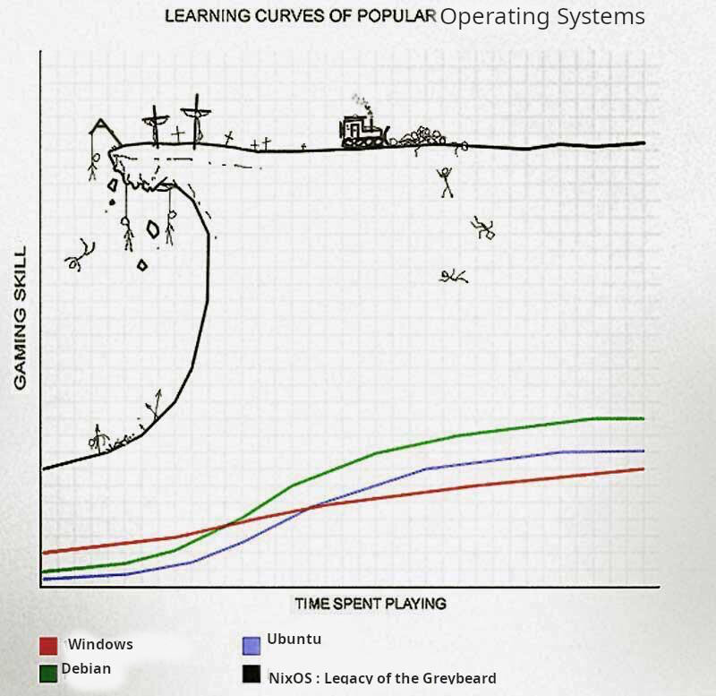

# Nix config

> These are my dotfiles, there are many like them but these ones are mine.
>
> - Dotfiles Creed

## Table of Contents

<!-- TOC -->

- [Nix config](#nix-config)
  - [Table of Contents](#table-of-contents)
  - [Overview](#overview)
  - [:warning: Warning](#warning-warning)
    - [Why?](#why)
  - [Layout](#layout)
    - [Folders](#folders)
  - [Setup](#setup)
    - [Bootstrap](#bootstrap)
    - [Manual (NixOS)](#manual-nixos)
  - [Usage](#usage)
    - [NixOS](#nixos)
    - [Home Manager](#home-manager)
  - [Updates](#updates)
  - [YOLO](#yolo)

<!-- /TOC -->

## Overview

<!--

-->

These are my `dotfiles` and system configurations managed as a Nix flake.

The idea behind the configuration layout is split into a few parts;

- _Home_ configuration is managed using Home Manager under [home](home).
- _Host_ configuration contains unique items for individual [hosts](hosts).
- _System_ configuration bundles common system services and programs under [system](system).

## :warning: Warning

:dragon: Here be dragons :dragon:

> The author is still on their journey to declarative enlightenment with Nix,
> so don't assume they know wtf they are doing or that this repo resembles best practice in any way, shape or form.

**EDIT:** Multiple years on using Nix and I still feel like I'm learning new things every day.

### Why?

After managing thousands of servers with CAPS tooling like Ansible and the Salt Project I longed for a declarative, immutable and single-source of truth configuration framework.

Then I found _Nix_ and _NixOS_.

Nix might not be perfect, but it's a hell of a lot better than the brittle, hacked together shell scripts that I have left behind.

NixOS might have a steep learning curve, but it's been worth it imo.

## Layout

### Folders

| Name            | Description                           |
| :-------------- | :------------------------------------ |
| home-manager/\* | Home configuration using Home Manager |
| nixos/hosts     | Host specific configuration           |
| nixos/system    | System configurations using Nix       |
| scripts         | Scripts not managed with Nix          |

## Setup

### Bootstrap

- [Bootstrap](docs/bootstrap.md)

## Updates

Updating the Nix flake lock file `flake.lock` is done via GitHub Actions.
