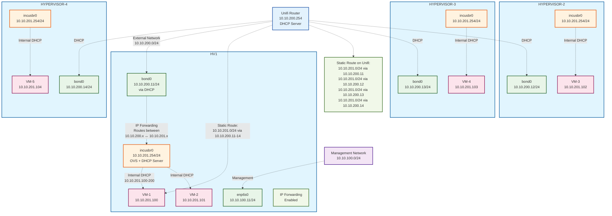

# Notes

## Table of Contents

- [Notes](#notes)
  - [Table of Contents](#table-of-contents)
  - [Overview](#overview)
  - [Deployment](#deployment)
    - [Steps to deploy](#steps-to-deploy)
      - [Stage 0 (Pre-flight checks)](#stage-0-pre-flight-checks)
      - [Stage 1 (OVN Cluster Creation)](#stage-1-ovn-cluster-creation)
      - [Stage 2 (Incus Cluster Creation)](#stage-2-incus-cluster-creation)
      - [Stage 3 (Cluster Joining)](#stage-3-cluster-joining)
      - [Stage 4 (Finalise)](#stage-4-finalise)
      - [Stage 4. (Login and configure)](#stage-4-login-and-configure)
    - [Steps to destroy](#steps-to-destroy)
  - [Network Configuration](#network-configuration)
  - [Network Layout](#network-layout)
    - [Hypervisor Networks](#hypervisor-networks)
    - [IP Assignments](#ip-assignments)
  - [External Router Configuration](#external-router-configuration)
  - [Diagram](#diagram)

## Overview

Notes from setting up the Incus cluster with staged OVN and Incus cluster creation.

The deployment follows a staged approach to avoid circular dependencies between OVN and Incus cluster formation.

## Deployment

### Steps to deploy

_A multi-stage saga to avoid circular dependencies._

#### Stage 0 (Pre-flight checks)

**Purpose:** Verify the system is ready for deployment.

1. ✅ Run `./scripts/incus-hypervisors.sh --health` script to check a few things before we begin.

**Expected Result:**

- Health check script passes

#### Stage 1 (OVN Cluster Creation)

**Purpose:** Create the OVN cluster first before Incus attempts to use it.

1. ✅ Update the nix flake with `ovn.joined = true` for **ALL** servers.
1. ✅ Keep `incus.joined = false` for **ALL** servers (Incus remains in local mode).
1. ✅ Run `./scripts/incus-hypervisors.sh --apply --yolo --force-reboot` script to create the OVN cluster.
1. ✅ Run `./scripts/incus-hypervisors.sh --health` script to verify the OVN cluster is working before continuing.

**Expected Result:**

- OVN cluster is formed and synchronised across all nodes
- Incus runs in local mode on each node
- OVN databases are clustered and accessible
- Health check script reports OVN cluster is healthy

#### Stage 2 (Incus Cluster Creation)

**Purpose:** Bootstrap the Incus cluster now that OVN is ready.

1. ✅ Update the nix flake with `incus.joined = true` for the **bootstrap** server only.
1. ✅ Keep `incus.joined = false` for member servers.
1. [ ] Run `./scripts/incus-hypervisors.sh --create --yolo` script to bootstrap the cluster.
1. [ ] Record the cluster tokens output from the script. However, **DO NOT** put them in the nix flake yet.
1. [ ] Run `./scripts/incus-hypervisors.sh --health` script to verify the bootstrap server is working before continuing.

**Expected Result:**

- Bootstrap server creates the Incus cluster
- Cluster tokens are generated for member servers
- OVN cluster continues to function

**NOTES:**

- The bootstrap server will be the only server in the 'incus' cluster
- OVN cluster is already established and functional

#### Stage 3 (Cluster Joining)

**Purpose:** Join member servers to the established Incus cluster.

1. [ ] Update the nix flake with `incus.joined = true` for member servers.
1. [ ] Update the nix flake with the `incus.clusterToken = "..."` for the member servers captured from stage 1.
1. [ ] Run `./scripts/incus-hypervisors.sh --join` script.
1. [ ] Run `./scripts/incus-hypervisors.sh --health` script to verify the cluster is working before continuing.

**Expected Result:**

- All servers are members of both OVN and Incus clusters
- Full cluster functionality is established

**NOTES:**

- Member servers will perform a data wipe prior to joining the cluster.
- Verify cluster membership by running `incus cluster list` on the bootstrap server.

#### Stage 4 (Finalise)

**Purpose:** Clean up temporary configuration and stabilize the cluster.

After verifying the members have joined successfully, run the following;

1. [ ] Update the nix flake with `incus.clusterToken = null` for all member servers
1. [ ] Run `./scripts/incus-hypervisors.sh --apply` script.
1. [ ] Run `./scripts/incus-hypervisors.sh --health` script to verify the cluster is working before continuing.

**Expected Result:**

- Configuration is cleaned up
- Cluster operates in steady state

**NOTES:**

- Verify all servers are reporting as `online` in the `incus cluster list` output.

#### Stage 4. (Login and configure)

**Purpose:** Access and configure the operational cluster.

1. [ ] Access the Incus Web API and configure your client certificate.
1. [ ] Optionally, run `./scripts/incus-hypervisors.sh --configure` script to configure some default incus settings that can't be done via preseed.

### Steps to destroy

_One shot to destroy them all._

1. ✅ Update the nix flake with `incus.joined = false` for all servers
1. ✅ Update the nix flake with `ovn.joined = false` for all servers
1. ✅ Update the nix flake with `incus.clusterToken = null` for all member servers
1. ✅ Run the `./scripts/incus-hypervisors.sh --yolo --destroy --force-reboot` script.

## Network Configuration

The configuration implements a **routed setup** where:

- Hypervisors get _management_ IP addresses from the "Platform" network (`10.10.100.0/24`)
- Hyperviros get _data_ IP addresses from the "Applications" network (`10.10.200.0/24`)
- VMs get IPs from isolated internal network (`10.10.201.0/24`)
- Traffic is routed between networks without NAT
- VMs are directly accessible from external network

## Network Layout

### Hypervisor Networks

- **Management**: `10.10.100.0/24` via `enp6s0`
- **Cluster**: `10.10.200.0/24` via `bond0` (DHCP from Unifi)
- **VM Network**: `10.10.201.0/24` via `incusbr1` (Internal DHCP)
- **Transparent Bridge**: `incusbr0` (No IP)

### IP Assignments

| Hypervisor   | Platform Management | Applications   |
| ------------ | ------------------- | -------------- |
| HYPERVISOR-1 | `10.10.100.11`      | `10.10.200.11` |
| HYPERVISOR-2 | `10.10.100.12`      | `10.10.200.12` |
| HYPERVISOR-3 | `10.10.100.13`      | `10.10.200.13` |
| HYPERVISOR-4 | `10.10.100.14`      | `10.10.200.14` |

## External Router Configuration

Added static routes on Unifi router:

```bash
10.10.201.0/24 via interface 10.10.200.254/24
```

## Diagram


